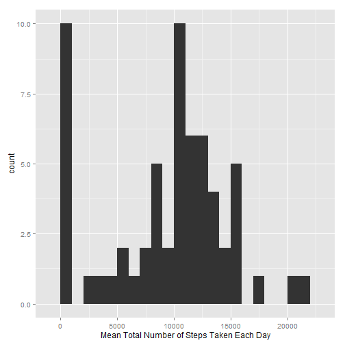
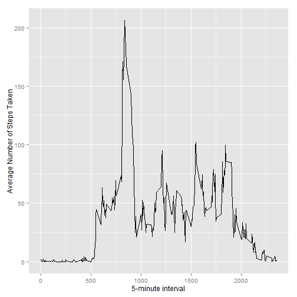
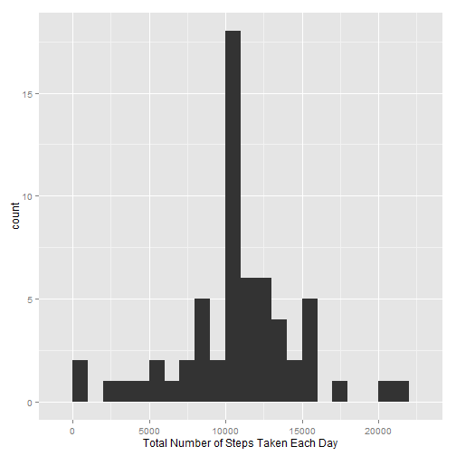

# Reproducible Research: Peer Assessment 1

## Loading and preprocessing the data

```r
unzip(zipfile="activity.zip")
data <- read.csv("activity.csv")
```

## What is mean total number of steps taken per day?

```r
library(ggplot2)
## Calculate the total number of steps taken per day
total.steps <- tapply(data$steps, data$date, FUN=sum, na.rm=TRUE)
## Using qplot to make a histogram
qplot(total.steps, binwidth=1000, xlab="Mean Total Number of Steps Taken Each Day")
```

 

```r
## Calculate and report the mean and median of the total number of steps taken per day
mean(total.steps, na.rm=TRUE)
```

```
## [1] 9354.23
```

```r
median(total.steps, na.rm=TRUE)
```

```
## [1] 10395
```

## What is the average daily activity pattern?

```r
library(ggplot2)
## Make a time series plot (i.e. type = "l") of the 5-minute interval (x-axis) and the
## average number of steps taken, averaged across all days (y-axis)
averages <- aggregate(x=list(steps=data$steps), by=list(interval=data$interval),
                      FUN=mean, na.rm=TRUE)
ggplot(data=averages, aes(x=interval, y=steps)) +
    geom_line() +
    xlab("5-minute interval") +
    ylab("Average Number of Steps Taken")
```

 

```r
## Which 5-minute interval, on average across all the days in the dataset, contains the maximum number of steps?
averages[which.max(averages$steps),]
```

```
##     interval    steps
## 104      835 206.1698
```

## Imputing missing values

There are many days/intervals where there are missing values (coded as `NA`). The presence of missing days may introduce bias into some calculations or summaries of the data.


```r
## Calculate and report the total number of missing values in the dataset (i.e. the total number of rows with NAs)
missing <- is.na(data$steps)
# How many missing
table(missing)
```

```
## missing
## FALSE  TRUE 
## 15264  2304
```

The strategy to fill in missing value: Now try to fill all of the missing values in with mean value for that 5-minute
interval.


```r
# Replace each missing value with the mean value of its 5-minute interval
fill.value <- function(steps, interval) {
    filled <- NA
    if (!is.na(steps))
        filled <- c(steps)
    else
        filled <- (averages[averages$interval==interval, "steps"])
    return(filled)
}
filled.data <- data
filled.data$steps <- mapply(fill.value, filled.data$steps, filled.data$interval)
```
Now, Make a histogram of the total number of steps taken each day and Calculate and report the mean and median total number of steps taken per day.


```r
total.steps <- tapply(filled.data$steps, filled.data$date, FUN=sum)
qplot(total.steps, binwidth=1000, xlab="Total Number of Steps Taken Each Day")
```

 

```r
mean(total.steps)
```

```
## [1] 10766.19
```

```r
median(total.steps)
```

```
## [1] 10766.19
```

Do these values differ from the estimates from the first part of the assignment? What is the impact of imputing missing data on the estimates of the total daily number of steps?

As you can see: Mean and median values are higher after inputing missing data. The reason is
that in the original data, there are some days with `steps` values `NA` for 
any `interval`. The total number of steps taken in such days are set to 0s by
default. However, after replacing missing `steps` values with the mean `steps`
of associated `interval` value, these 0 values are removed from the histogram
of total number of steps taken each day. The missing values take effects to our result before. That's why we've got the new results (and seem more clearly) after inputting the value for missing data.

## Are there differences in activity patterns between weekdays and weekends?
First, let's find the day of the week for each measurement in the dataset. In
this part, we use the dataset with the filled-in values above.


```r
## Create a new factor variable in the dataset with two levels - "weekday" and "weekend"
## indicating whether a given date is a weekday or weekend day.
weekday.or.weekend <- function(date) {
    day <- weekdays(date)
    if (day %in% c("Monday", "Tuesday", "Wednesday", "Thursday", "Friday"))
        return("weekday")
    else if (day %in% c("Saturday", "Sunday"))
        return("weekend")
    else
        stop("invalid date")
}
filled.data$date <- as.Date(filled.data$date)
filled.data$day <- sapply(filled.data$date, FUN=weekday.or.weekend)
```

Now, let's make a panel plot containing plots of average number of steps taken
on weekdays and weekends.

```r
## Make a panel plot containing a time series plot (i.e. type = "l") of the 5-minute interval
## (x-axis) and the average number of steps taken, averaged across all weekday days or
## weekend days (y-axis).
averages <- aggregate(steps ~ interval + day, data=filled.data, mean)
ggplot(averages, aes(interval, steps)) + geom_line() + facet_grid(day ~ .) +
    xlab("5-minute interval") + ylab("Number of steps")
```

 
